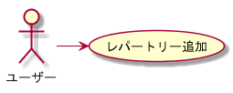
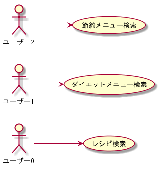
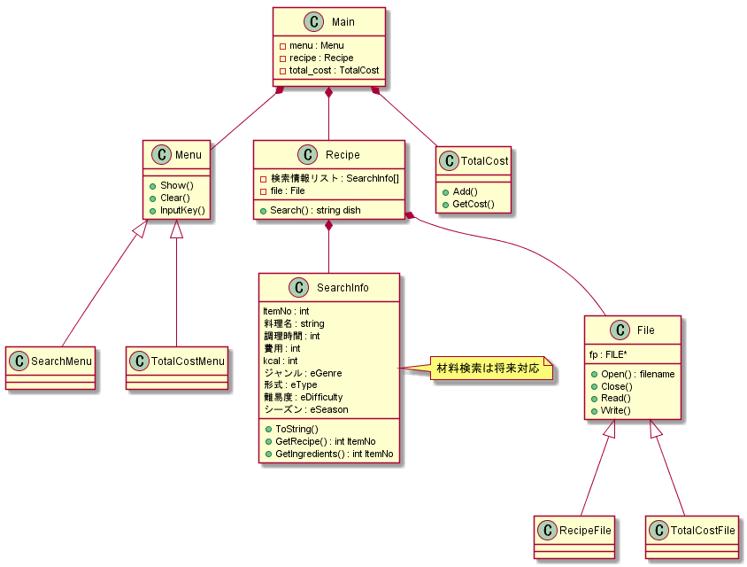

# クッキングプランナー開発

## プログラミング開発要素

- オブジェクト指向
  - C++によるクラス・オブジェクト
  - UMLによるダイアグラム作成
- アルゴリズム
  - データ検索
  - あなたにオススメ
- ファイルアクセス

## 作ろうとするものを明らかにする

先ずは作ろうとするものを明らかにする事から始めましょう。ざっくりとですが、イメージを書き連ねてみます

- どういうものを作りたいのか？

  - 料理レシピを調べる事が出来る
  - 自身のレパートリーを元に、献立を作成する事が出来る

- レパートリーを元にオススメを選んでくれる

  - あくまで自分のレパートリーである事がポイント
  - ダイエット・節約といった指定に応じて、自分のレパートリーから適したものをチョイス

  - 指定した費用・カロリーを元に献立を考えてくれる
    - 費用やカロリーを考えた料理を覚える動機になるかも

- 家計簿機能とは？

  - 選ばれた料理の費用を管理してくれる
  - 一日平均や月合計などの集計機能を持つ

### 要件定義

ここまでの内容を元に、機能要件を整理してみます

- レパートリーが登録出来る事
- 指定した条件で検索が出来る事
- 検索条件として「ダイエット」「節約」といった検索条件セットが用意されている事
- 検索結果として選んだ料理に対して、カロリー・費用などの情報を集計する

### ユースケース

次に具体的なこのソフトウェアが使われるケースを考えてみます

#### レパートリー登録

#### 料理検索

#### 献立作成機能

機能要件をもう少し検討する為、[こちら](./献立作成.md)で詳細を考えてみます

## 構成要素を検討する

次にこのソフトウェアに関連する部品を検討します。

### コンポーネント図

保留

### クラス図

# 動作仕様を検討する

## 状態遷移

モードや画面がどうやって遷移するのか考えます。これらについては[別資料](./state_screen.md)としてまとめました。

