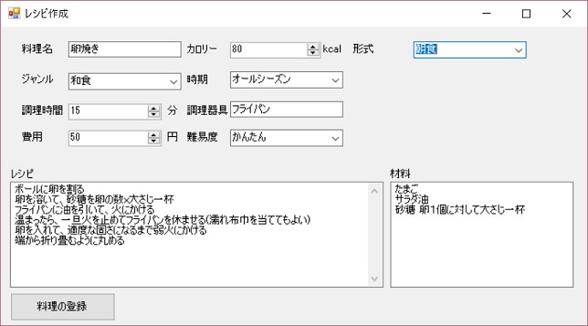
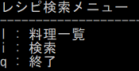
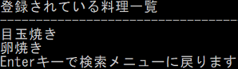
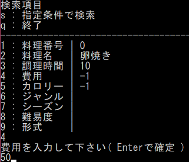
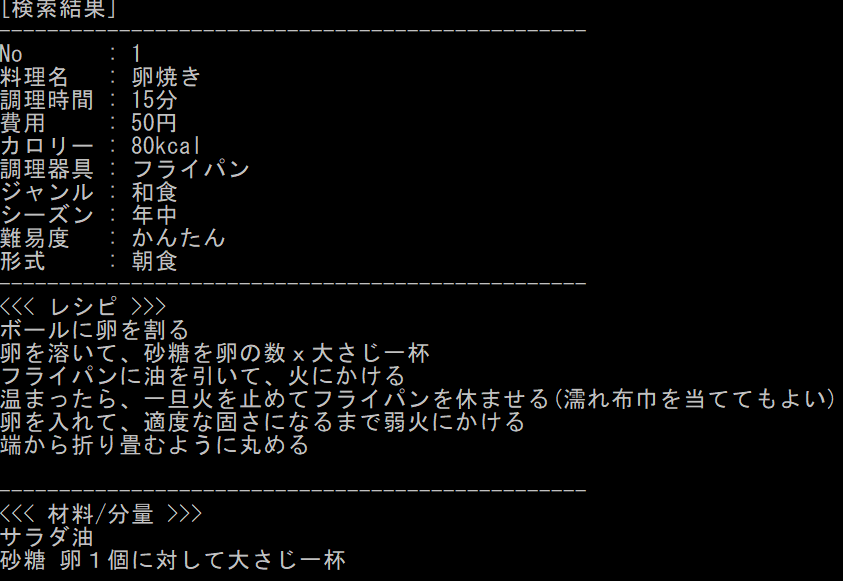

# ソフトウェア開発 第２弾

## はじめに

先ず前プロジェクトを振り返って得られた知見を、今回のプロジェクト立ち上げに反映させる事にします。

### カレンダー開発を振り返り

カレンダーソフトを開発する中で、様々なアイディアが追加され、当初考えていたものよりもかなり豪華なものとなりました。一旦実用上の要件としては概ね満たしているので、一旦開発は終了としたいと思います。

### 新プロジェクトへ発足に当たって

カレンダーソフトの性質上、どうしてもカバー仕切れないソフトウェア開発要素がありました。今回の新プロジェクトを発足させるに辺り、簡単なディスカッションを行いました。その内容を受けて、プロジェクトの方向性を決めたいと思います。

[ディスカッション](./MyRecipeNote.md)

## プロジェクト検討

方向性としては、

- 料理とそのレシピを調べられるようにしたい
  - カロリー・費用などの検索条件を指定出来る
  - オススメ紹介。献立を考えてくれる
- 費用などを元に家計簿代わりの事をしてくれる

といったものがあります。要約すると

- 家計簿＋料理レシピ本

というものなので、名称は仮に**クッキングプランナー**としておきます。

# 参考)プロトタイプ版開発

カレンダーソフトウェアとかなり違った作り方になるので、先ずはプロトタイプ版を作ってみました。といっても、このプロトタイプでは以下の機能デモを作る事を目的としているので簡易的なものとなっています

- 料理レシピを登録する(C#アプリ)
- 料理名・カロリーなどを元に登録されている料理情報を検索する

なお、検討のメインはあくまでC++で開発されるものとしますので、料理登録を行う側のツールについてはソースプロジェクトを公開するに留めます。悪しからずご了承ください。

## 料理登録アプリ

[開発プロジェクト(Visual C# 2019製)](../src/cs/MyRecipeNote)

### 画面イメージ

## 料理検索アプリ

[開発プロジェクト(Visual C++ 2019製)](../src/cpp/MyRecipeNote)

### 画面イメージ

#### トップメニュー

#### 料理一覧

#### 検索メニュー

#### 検索結果表示

# クッキングプランナー開発

では早速ソフトウェアの検討に移りましょう

[クッキングプランナー開発](./CookingPlanner.md)

