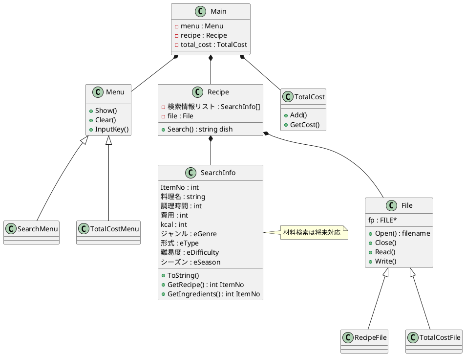

## クラス図



## コンポーネント

```plantuml
@startuml

家計簿 "家計簿"{
    package "package"{
        []

    }
}

cloud "Cloud" {
  package "Package" {
    [register]
    frame "frame" {
      [backup]
    }
  }
}

node "Node" {
  database "Database" {
    [store]
  }
  folder "Folder" {
    [File]
  }
}

[register] .. [store] : HTTP
[backup] .. [File] : FTP

@enduml
```
