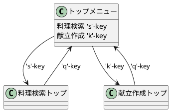
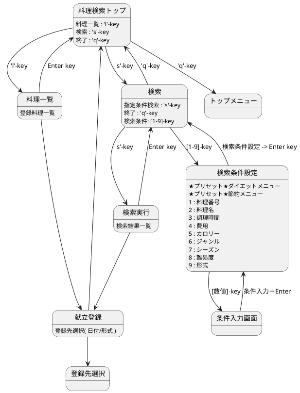
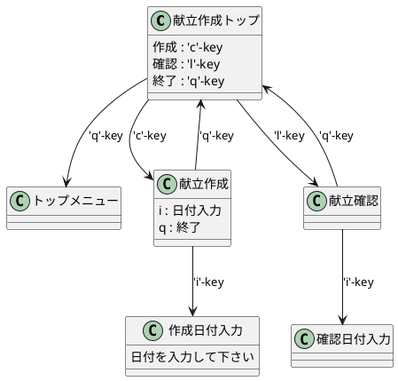

```plantuml
@startuml

'トップメニュー'
トップメニュー --> 料理検索トップ : 's'-key
トップメニュー --> 献立作成トップ : 'k'-key
トップメニュー : 料理検索 's'-key
トップメニュー : 献立作成 'k'-key

料理検索トップ --> トップメニュー : 'q'-key

献立作成トップ --> トップメニュー: 'q'-key

@enduml
```

## 料理検索

```plantuml
@startuml

'検索トップ'
料理検索トップ--> 料理一覧 : 'l'-key
料理検索トップ--> 検索 : 's'-key
料理検索トップ--> トップメニュー : 'q'-key
料理検索トップ: 料理一覧 : 'l'-key
料理検索トップ: 検索 : 's'-key
料理検索トップ: 終了 : 'q'-key

'料理一覧'
料理一覧 --> 料理検索トップ: Enter key
料理一覧 --> 献立登録
料理一覧 : 登録料理一覧

'検索'
検索 --> 検索実行 : 's'-key
検索 --> 料理検索トップ: 'q'-key
検索 --> 検索条件設定 : [1-9]-key
検索 : 指定条件検索 : 's'-key
検索 : 終了 : 'q'-key
検索 : 検索条件: [1-9]-key 

'検索実行'
検索実行 --> 検索 : Enter key
検索実行 --> 献立登録
検索実行 : 検索結果一覧

'検索条件設定'
検索条件設定 --> 検索 : 検索条件設定 -> Enter key
検索条件設定 --> 条件入力画面 : [数値]-key
検索条件設定 : ★プリセット★ダイエットメニュー
検索条件設定 : ★プリセット★節約メニュー
検索条件設定 : 1 : 料理番号
検索条件設定 : 2 : 料理名
検索条件設定 : 3 : 調理時間
検索条件設定 : 4 : 費用
検索条件設定 : 5 : カロリー
検索条件設定 : 6 : ジャンル
検索条件設定 : 7 : シーズン
検索条件設定 : 8 : 難易度
検索条件設定 : 9 : 形式

献立登録 --> 登録先選択
献立登録 --> 料理検索トップ
献立登録 : 登録先選択( 日付/形式 )

条件入力画面 --> 検索条件設定 : 条件入力＋Enter
@enduml
```

## 献立作成

```plantuml
@startuml

'家計簿トップ'
献立作成トップ --> トップメニュー : 'q'-key
献立作成トップ --> 献立作成 : 'c'-key
献立作成トップ --> 献立確認 : 'l'-key
献立作成トップ : 作成 : 'c'-key
献立作成トップ : 確認 : 'l'-key
献立作成トップ : 終了 : 'q'-key

献立作成 --> 献立作成トップ : 'q'-key
献立作成 --> 作成日付入力 : 'i'-key
献立作成 : i : 日付入力 
献立作成 : q : 終了

作成日付入力 : 日付を入力して下さい

献立確認 --> 確認日付入力 : 'i'-key
献立確認 --> 献立作成トップ : 'q'-key

'mm/dd'形式で日付を入力

@enduml
```
