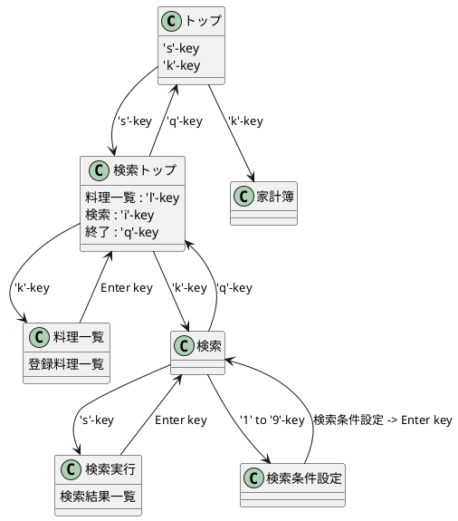

```plantuml
@startuml

'トップメニュー'
トップ --> 検索トップ : 's'-key
トップ --> 家計簿 : 'k'-key
トップ : 's'-key
トップ : 'k'-key

'検索トップ'
検索トップ --> 料理一覧 : 'k'-key
検索トップ --> 検索 : 'k'-key
検索トップ --> トップ : 'q'-key
検索トップ : 料理一覧 : 'l'-key
検索トップ : 検索 : 'i'-key
検索トップ : 終了 : 'q'-key

'料理一覧'
料理一覧 --> 検索トップ : Enter key
料理一覧 : 登録料理一覧

'検索'
検索 --> 検索実行 : 's'-key
検索 --> 検索トップ : 'q'-key
検索 --> 検索条件設定 : '1' to '9'-key

'検索実行'
検索実行 --> 検索 : Enter key
検索実行 : 検索結果一覧

'検索条件設定'
検索条件設定 --> 検索 : 検索条件設定 -> Enter key

@enduml
```
