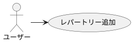
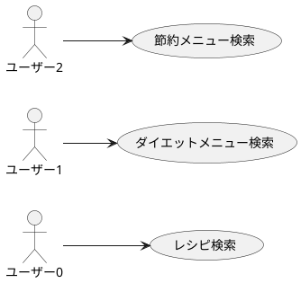

# クッキングプランナー

## レパートリー登録ツール

```plantuml
@startuml
ユーザー -> (レパートリー追加)
@enduml
```

## クッキングプランナー

```plantuml
@startuml

left to right direction
ユーザー0 --> (レシピ検索)
ユーザー1 --> (ダイエットメニュー検索)
ユーザー2 --> (節約メニュー検索)
@enduml
```

