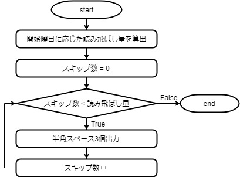
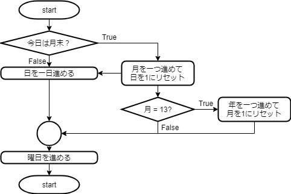

# いちねんカレンダー機能を作る

Today機能を一から自分で作るのは意外と難しいのでGoogle先生に頼ってみました。現在の日時情報を知るには、コンピュータにある日付情報をどうにかして取得する必要があります。こういった処理は、通常ならばOSから提供される機能を利用する必要があり、それには標準ライブラリ関数を使うのが一般的です。

次に、いちねんカレンダー機能の実現方法について考えてみましょう。

## 出力イメージを考える

出力イメージを示します。なお、レイアウトが崩れてしまいますので、MS明朝などの固定ピッチフォーマットでご覧下さい。

```
 1月のカレンダー ←(a)

日 月 火 水 木 金 土 ←(b)
       1  2  3  4  5 ←(c)(d)
 6  7  8  9 10 11 12
13 14 15 16 17 18 19
20 21 22 23 24 25 26
27 28 29 30 31 ←(e)
```

プログラムでは上の行から順番に出力するので、以下のような処理順序になります

1. 「xx月のカレンダー」部分を出力する(a)
2. 曜日部分を出力する(b)
3. 開始曜日まで空白を入れる(c)
4. 日の部分を1から順に出力していき、土曜日の位置で折り返す(d)
5. 月末まで出力出来たら終了

#### カレンダーを作るには？

次に具体的に具体的な処理手順を考えてみましょう。こういう時には

「カレンダーを作る為には、何が必要か？」

を考えてみるとどうやって進めるのかのヒントが得られます。今回のケースであれば**どういった情報があれば、カレンダーを作成する事が出来るのか？**から考えてみるのが良いでしょう。


このように**ソフトウェアを組む上で必要なデータ**を考える事は、プログラミングにおいて最も重要なものとされ、著名なソフトウェア工学者のロブ・パイクが述べた言葉にも以下のようなものがあります。

> データが最も重要である。 正しいデータ構造と編成を選択すれば、アルゴリズムは自明のものとなります。アルゴリズムではなく、データ構造こそがプログラミングの中心です

## データ構造

では、早速いちねんカレンダー機能において必要なデータ構造を考えてみましょう。

カレンダーの構造を考えてみると、以下のルールで成り立っている事が分かります。

- 月は1～12月までの12進数
- 日は必ず1日から始まるが、月末は28～31日のパターンがある
- 曜日は年月日によって変わり、例えば2018年と2019年の1/1の曜日は異なる


これらの情報から**特定月のカレンダーを作成する場合に必要な情報**は

- その月が何日まであるのか？
- その月の1日は何曜日から始まるのか？

の二点が決まれば良いので、**これをプログラムにすれば特定月のカレンダーを作成出来る**ようです

- その月が何日まであるのか？
- その月は何曜日まであるのか？

### カレンダー情報型を定義する

では、早速これをデータとして定義してみましょう

| データ名 | 設定値制限                           | 型     |
| -------- | ------------------------------------ | ------ |
| 月末     | 28～31                               | 整数型 |
| 開始曜日 | "月"、"火"、"水"、"木"、"月"、"月"、 | 列挙型 |

月ごとに上のデータがあれば良さそうです。では、C言語でこれを表現してみます。

```cpp
// 曜日を示す列挙型
typedef enum
{
    Sun = 0, // 日曜日
    Mon, // 月曜日
    Tue, // 火曜日
    Wed, // 水曜日
    Thu; // 木曜日
    Fri; // 金曜日
    Sat; // 土曜日
}eWeekday;

// カレンダー作成用情報
typdef struct{
    int      eom;    // 月末( end of month )
    eWeekday start_weekday; // 開始曜日
}MonthInfo;
```

このように定義したeWeekdayやMonthInfo型の情報を使えば、例えば2018/12であれば**土曜日から始まり、31日で終わる**という内容を以下のように定義する事が出来ます

```cpp
MonthInfo month_info_2018_12;
month_info_2018_12.eom = 31;  // 2018/12は31日まで
month_info_2018_12.start_weekday  = Sat; // 2018/12は土曜日から始まる
```

さらに、この型を配列にすれば2019年データを定義する事が出来ます

```cpp
MonthInfo
month_info_2019[] = {
    // eom, start_weekday
    {  31,  eTue }, // 2019/01
    {  28,  eFri }, // 2019/02
    {  31,  eFri }, // 2019/03
    {  30,  eMon }, // 2019/04
    {  31,  eWed }, // 2019/05
    {  30,  eSat }, // 2019/06
    {  31,  eMon }, // 2019/07
    {  31,  eThu }, // 2019/08
    {  30,  eSun }, // 2019/09
    {  31,  eTue }, // 2019/10
    {  30,  eFri }, // 2019/11
    {  31,  eSun }, // 2019/12
};
```

これでカレンダーを作る為に必要なデータが揃いました。では、今度はそのデータを使ってカレンダーを作成していきましょう。なお、計算機学においては**「プログラミング= データ構造＋アルゴリズム」**という形で表現される事がありますが、さしづめここで決めたのがデータ構造で、出力処理を行うのがアルゴリズムといった所です)

## 出力処理(アルゴリズム)

### タイトル/曜日部分を出力する

では、最初にタイトル/曜日部分の出力処理を書いてみましょう。

```
2019年 1月のカレンダー
日 月 火 水 木 金 土
```

出力k処理で使用するのは、(恐らくはC言語で最初に学ぶであろう)printf()関数を使います。

```cpp
int year = 2019;
int month = 1;
printf( "%4d年%2d月のカレンダー\n\n", year, month );
printf( "日 月 火 水 木 金 土\n" );
```

## "日"出力前の空白を出力する

カレンダーの曜日部分は必ず日曜日から始まるので、例えば**1日が火曜日から始まる場合には日・月を飛ばしてから1日を出力する**必要があります。この処理を書く為には、二つほどC言語知識が必要になるので説明しておきましょう。先ずは列挙型と整数値の関係について述べます

### 列挙型と整数値の関係

```
日 月 火 水 木 金 土
      1  2  3  4  5
<---->この部分をスキップする
```

カレンダーを作成するのに必要な情報はMonthInfoに含まれていますが、この中の**開始曜日の情報を示すMonthInfo.start_weekday**を使用します。C言語の列挙型の特徴として、列挙型のそれぞれの値(正式名称は列挙子と言いますが、プロでも正確な呼称を知っている人は稀です)は、整数値として扱う事が出来ます

```cpp
// 曜日を示す列挙型
typedef enum
{
    eSun = 0,
    eMon,
    eTue,
    eWed,
    eThu,
    eFri,
    eSat,
    eWeekEnd,
}eWeekday;
```

eWeekdayの定義であれば、以下の表のように整数値が割り当てられます。この時、**曜日によって読み飛ばす量は、整数値側の値を使用する**事が出来ます。表に合わせてスキップ量を記載しておきます

| 列挙子 | 整数値( = スキップ量に等しい) |
| ------ | ----------------------------- |
| eSun   | 0                             |
| eMon   | 1                             |
| eTue   | 2                             |
| eWed   | 3                             |
| eThu   | 4                             |
| eFri   | 5                             |
| eSat   | 6                             |

しかし、スキップ量が分かった所で、コンピュータに**「２つの曜日分を読み飛ばして」と命令するには、相応の空白文字を出力**する事で実現する事が出来ます。この時**書式指定文字列**を使用すると便利です

### 書式指定文字列

書式指定文字列はprintf()関数で使用されるので、(概念はさておいて)見覚えはあると思います。

先ずは最初に学ぶC言語のプログラムを見てみましょう。

```cpp
#include <stdio.h>

int main( void )
{
    printf( "Hello World\n" );
    return 0;
}
```

ここで出てくる**printf()関数への引数として使用されるのが書式指定文字列**で、第一引数で渡されます。これは、出力フォーマットを指定する機能を有する特殊な文字列となっていて、指定された変数に対して出力形式を指定出来るようになっています。以下の例を見てみましょう

```cpp
int val = 123;
printf( "val is %d\n",   val ); // val is 123(valをそのまま%dの位置に表示)
printf( "val is %4d\n",  val ); // val is  123(valを4桁幅の数字として出力)
printf( "val is %04d\n", val ); // val is 0123(valを4桁幅かつ0埋めの数字として出力)
```

読み飛ばす際には**『曜日行』と『日の行」の位置が一致するようにスキップ**させる必要があります。この時**全角文字の漢字は2文字分の幅を取り、次の曜日までのスペース1文字とを合わせて3文字分の文字幅を取ればよい**事が分かります。以下のサンプルを確認してみて下さい

```cpp
"月_" // 曜日行の出力
" 1_" // 日の行の出力
"012" // 文字列幅
    
printf( "月 " ); // 全角文字(2文字分)と半角スペース1つの合計3文字幅
printf( "   " ); // 半角スペース3つ分
```

### 読み飛ばし部分のコード

ここまでで読み飛ばしの準備が出来ましたので、ソースコードを示します

```cpp
eWeekday weekday = Tue; // 火曜日までスキップする
// for文でスキップの数だけ、空白出力を繰り返す( skipが0～1の間{}の処理を繰り返す )
for( int skip = 0; skip < ( int )weekday; skip++ )
{
    	printf( "   " ); // 半角スペース3つ分の空白を出力する	
}
```

フローチャートで示すと以下のようになります



## 日部分の出力

最後は日部分の出力です。あと一息ですね。

```
       1  2  3  4  5
 6  7  8  9 10 11 12
13 14 15 16 17 18 19
20 21 22 23 24 25 26
27 28 29 30 31 ←(e)
```

先ずは処理の流れをざっと考えてみましょう。

1. 1から月末までの数字を出力する)(printf()で3文字幅にする)
2. 土曜日の出力が終わったら改行する
3. 月末まで出力したら終了

1日の出力位置までの読み飛ばし処理は終わっているので、あとは土曜日の改行ですね。1日から順番に出力する際に、合わせて曜日情報を進めていけば処理が実現出来そうですね。という訳で、新たに**本日の情報を示すデータ型**を定義しました(TodayInfo)

```cpp
// 本日を示す構造体
typedef struct
{
    int year;
    int month;
    int day;
    eWeekday weekday;
}TodayInfo;
```
また日を進める際には色々な処理を行う必要があるので、専用の関数を用意する事にします。
```cpp
// 曜日を進める
static eWeekday
next_weekday( eWeekday current )
{
    switch( current )
    {
    case eSun: return eMon;
    case eMon: return eTue;
    case eTue: return eWed;
    case eWed: return eThu;
    case eThu: return eFri;
    case eFri: return eSat;
    case eSat: return eSun;
    default:
            assert( 0 ); // ここに入る事はないので、万一入ったら異常終了させる
            return eWeekEnd; // ここは通らない
    }
} // next_weekday()

// TodayInfo型データを一日進める関数
// 引数のeomはend of monthで月末の意
static void
step_today_info( TodayInfo *today, int eom )
{
    if( today->day != eom ) // 今日は月末でない？
    {
        ( today->day )++; // 日を1日進める
    }
    else // 今日は月末？
    {
        // 一か月進めて、1日に戻す
        // 年末なら、1年進めて1月に戻す
        today->day = 1;
        ( today->month )++;
        if( today->month == 13 ) // 年末？
        {
            ( today->year )++;
            today->month = 1;
        }
    }

    // 曜日を進める
    today->weekday = next_weekday( today->weekday );
} // step_today_info()
```

step_today_info()関数のフローチャートを示しておきます



### MEMO：スコープの考え方

上で定義した関数はそれぞれstatic関数として定義しています。これは**その関数がどこから使えるか？**を決めるもので、**スコープと呼ばれる定義の有効範囲を示す**ものとなります。

- static関数(ローカルスコープ)
  - その関数が定義されたファイル内でのみ有効
- 何も付けていない関数(グローバルスコープ)
  - そのソースコードを含むアプリケーションなら、どこからでも使える

「大は小を兼ねるから、グローバルスコープだけでいい」

と思われるかもしれませんが、大人数で開発をしていると

「AさんとBさんが同じ名前の関数を定義してしまった」

という事が頻繁に発生して、リンクの際に多重定義エラーを引き起こします。プログラミングにおいては、局所化を常に意識する事が大切です。

### 日部分を出力する

ここまでに示したデータ構造と関数を使えば、日部分は以下のように書く事が出来ます

```cpp
    // 日部分を出力する
    TodayInfo today = { year, month, 1, pInfo->start_weekday };
    for( int day = 0; day < pInfo->eom; day++ )
    {
        printf( "%2d ", today.day );
        // 土曜日まで出力したら、改行して折り返す
        if( today.weekday == eSat )
        {
            printf( "\n" );
        }
        step_today_info( &today, pInfo->eom ); // 1日進める
    }
	printf( "\n" );
```

フローチャートは以下の通りです


これでいちねんカレンダー機能が完成しました