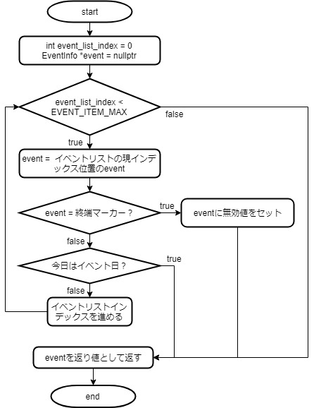

# イベントお知らせ機能

いちねんカレンダー機能を実装してみましたが、いかがでしょうか？色々と考えるべき内容が盛り沢山で大変だったと思います。次のイベントお知らせ機能は、カレンダーソフトの処理の中でも複雑なものになりますが、いちねんカレンダーが理解出来ればこちらについても理解出来ると思います。

## 機能イメージ

**イベントお知らせ機能**のイメージをもう少し具体化しましょう。

- 特定の日をお知らせする機能
  - カレンダー上に表示するのは大変なので、枠外で
- 特定の日時の定義
  - 定時退社日
    - 給料日(25日)
    - プレミアムフライデー
    - 長期連休前(3連休以上)
  - 祝日
  - プライベートイベント（飲み会など）

## 処理の流れを考える

処理の流れは概ね以下のようになるでしょうか。文章にすると随分とアッサリしていますが、中身の処理は混みいったものになります。

- 当月にある日を順番にイベント条件と照らし合わせる
  - 一致した場合、その日を一致したイベントと一緒に出力する

## イベント条件判定

次に照らし合わせるイベント条件について、もう少し詳しく考えてみましょう

- 定時退社の判定
  - 25日かつ平日
  - 3連休を超える連休直前の出勤日
  - 最終金曜日(プレミアムフライデー)
- 祝日/プライベートイベント
  - 祝日/プライベートイベント一覧表に合致するエントリがある場合

これらの内容を見て、

- 1日から順番に月末までをイベント判定する為、常に最新の出勤日を保存しておく必要がある
  - 連休判定は休日が3つ以上続いて初めて分かるため
- 祝日/プライベートイベント判定用テーブルを用意する

こういった内容にまで考えが及ぶようであれば、プログラミングに関する理解が相当進んでいると思います。

## データ構造

機能のイメージと処理の大まかな流れが見えてきた所でプログラム設計に入りましょう。

まずプログラムで最も重要なデータ構造について考えてみます。イベントお知らせ機能では、

- 定時退社日
- 特定のイベント

の二つの判定が必要になりますが、いずれにおいても**当月分のイベント情報が必要になりそう**です。ここでは、イベント情報を以下のように定義しました

```cpp
typedef struct
{
    int day; // イベント日
    const char *event_name; // イベント名
    bool is_holiday; // true:休日 false:平日
}EventInfo;
```

| 変数名     | イベント名称 | 入力値例 |
| ---------- | ------------ | -------- |
| day        | イベント日   | １       |
| event_name | イベント名   | 元旦     |
| is_holiday | 休日か否か   | true     |

イベント情報は二次元配列として、月ごとのイベントのリストとして定義されます。月ごとの終端値は、無効データを入れておく事でイベント終端として扱います。こういったデータの事を番兵( sentinel )と呼びます。

```cpp
EventInfo
event_info_2019[][ EVENT_ITEM_MAX ] = {
    { // 2019/1
        // { day, event_name, is_holiday}
        { 1, "元旦", true },
        { 7, "七草の日", false },
        { 14,"成人の日", true },
        { EVENT_END,nullptr, false },
    },
    { // 2019/12
        // { day, event_name, is_holiday}
        { 23, "天皇誕生日？", true },
        { 24, "クリスマスイブ", false },
        { 25, "クリスマス", false },
        { 31, "大晦日", false },
        { EVENT_END,nullptr, false },
    },
};
```

### 必要そうな関数を準備しておく

イベントお知らせ機能を作ってみたのですが、冗長(似たような)な処理が多く出てきたので、そういった部分は関数化してコードをスッキリさせています。具体的には以下の処理が該当します

- 指定日がイベント情報リストに含まれるかどうかを判定する
- 指定日が休日かどうかを判定する

それぞれの関数の処理をコードと共に簡単に説明しておきます。

### イベント日判定( check_event_day() )

引数で渡された日がイベント日かどうかを調べます。本関数は、イベント情報リストに該当エントリが含まれていればそのエントリを、含まれていない場合は無効データを返します。

- 有効な( EventInfo*型の )イベント情報が返ってくる
  - 指定日はイベント日。イベント情報へのポインタを返す
- 無効データ( nullptr )
  - 指定日はイベント日ではありません。返り値は無効ポインタです

具体的なコードは以下の通りです。引数にconstが付いていますが、これは**この関数内で引数で渡したデータが書き換えられない**事を示すものです。(constが無ければ**引数で渡したデータが関数内で変更出来てしまう**為、関数の設計意図を示す為constを付けるのがセオリーです。

```cpp
static EventInfo*
search_event_list( const TodayInfo *today )
{
    int event_list_index = 0;
    EventInfo *event = nullptr;
    while( event_list_index < EVENT_ITEM_MAX )
    {
        event = &( event_info_2019[ today->month - 1 ][ event_list_index ] );
        // イベント終端判定( 構造体メンバ全てが無効値のものをリスト終端として扱う )
        if( ( event->day == EVENT_END ) &&
            ( event->event_name == nullptr ) &&
            ( event->is_holiday == false ) )
        {
            event = nullptr; // 該当エントリなしを示す無効ポインタを返す
            break;
        }
        else if( event->day == today->day ) // イベントリストに指定日あり
        {
            break; // 現在のイベント情報を上位へ返す
        }
        event_list_index++; // イベントリストのインデックスを進める
    }
    return event;
} // search_event_list()
```

フローチャートについても紹介しておきます



### 休日判定( check_holiday() )

引数で渡された日が休日かどうかを判定します。といっても判定基準はいい加減なもので、以下の条件に該当すれば休日と判定しています。

- 土日
- イベント情報リストを見て、休日指定されている

この関数でもイベント情報リストを参照する必要があるのでcheck_event_info()を利用します。

```cpp
static bool
check_holiday( const TodayInfo *today )
{
    bool judgement = false;

    // 土日判定
    if( ( today->weekday == eSat ) ||
        ( today->weekday == eSun ) )
    {
        judgement = true;
    }
    else // 祝日判定
    {
        EventInfo *event = search_event_list( today );
        if( event != nullptr ) // 該当イベントが見つかった？
        {
            if( event->is_holiday ) // 該当日は祝日？
            {
                judgement = true;
            }
        }
    }
    return judgement;
} // check_holiday()
```

フローチャートはこちらです


### イベント日の出力

指定月を1日から順番にcheck_event_day()へ渡し、イベントリストに該当エントリが無いかを探します。「該当イベントがある＝イベント日」なので、イベントの詳細情報を表示します。**search_event_list()の返り値が無効データ( nullptr )でなければ、イベントリストに該当イベントがある**と判定しているのがポイントです。

```cpp
static void
print_event_alert( const TodayInfo *start, int eom )
{
    TodayInfo today = *start;
    while( today.day < eom )
    {
        EventInfo *event = search_event_list( &today );
        if( event != nullptr ) // 該当イベントが見つかった？
        {
            printf( "%2d/%2dは%sです\n", today.month, today.day, event->event_name );
        }
        step_today_info( &today, eom ); // 1日進める
    }
    printf( "\n" );
} // print_event_alert()
```

### 定時退社日判定

本関数がこのソフトで最も複雑な処理を行っていると思います。

考え方のポイントを示しておきます。

- 連続する休日は、あくまで一つの連休として扱う。
  - is_cont_holidays変数がtrueの間が連休中と判定されます。
    - **連続する休暇を一つの連休として扱う為**もの。例えば連続休暇数だけで判定しようとすると**連続休暇数が3なら直前の出勤日を出力する**となって分かりにくいからです。
  - 25日が給料日かつ平日の場合は定時退社判定
  - １日から順番にイベント判定を行う際に、平日の金曜日をlast_fridayへ保存する
    - 月末到達時点でのlast_fridayがプレミアムフライデーとなる

では、ソースコードです

```cpp
static void
print_no_overtime( const TodayInfo *start, int eom )
{
    TodayInfo today = *start;

    int bef_bussiness_day = today.day;
    int cont_holidays = 0; // 連続休暇数
    int last_friday = NOT_FOUND;
    printf( "★定時退社日★\n" );
    while( today.day < eom )
    {
        if( check_holiday( &today ) ) // 本日は休日？
        {
            cont_holidays++; // 連続休日数をインクリメント
        }
        else // !is_holiday( = 平日 )
        {
            // 3連休判定(連休終了時に直前の出勤日を出力する)
            if( cont_holidays >= 3 ) // 3連休以上だった？
            {
                printf( "%2d日\n", bef_bussiness_day );
            }
            cont_holidays = 0; // 連続休日数カウントをクリア
            // 給料日の定時退社判定
            if( today.day == SALARY_DAY )
            {
                printf( "%2d日\n", today.day );
            }
            // 後のプレミアムフライデー判定用に最終金曜日を保存
            if( today.weekday == eFri )
            {
                last_friday = today.day;
            }
            bef_bussiness_day = today.day; // 直近の営業日を更新する
        }
        step_today_info( &today, eom ); // 1日進める
    }

    // プレミアムフライデー出力
    if( last_friday != NOT_FOUND )
    {
        printf( "%2d日\n", last_friday );
    }
} // print_no_overtime()
```

フローチャートもかなりのボリュームになりました


これで予定していた機能の全てが実装出来ました

## オマケ

上のコードですが、実はまだバグと不便な点があります。

- 複数の定時退社判定が重なった場合、同一日が複数表示される
- 日付が昇順でない

修正の方法はいくつかありますが、C++の機能であるrange based forとSTLライブラリを使う事で簡単に修正する事が出来ます。std::setとはデータ構造の一つでコンテナクラスと呼ばれます。このコンテナは以下のような特徴を持つ為、コードを少し置き換えるだけで期待する動作を行ってくれます。

- データが順序通り並べられる
- 重複データは削除される

また、STLコンテナクラスを使うとfor文の機能が拡張(？)され、コンテナ内のデータを一括表示するようなコードをスッキリ書く事が出来ます。

```diff
static void
print_no_overtime( const TodayInfo *start, int eom )
{
    TodayInfo today = *start;
+   std::set< int > results_days;

@@@ 中略
    // 3連休判定(連休終了時に直前の出勤日を出力する)
    if( cont_holidays >= 3 ) // 3連休以上だった？
    {
-        printf( "%2d日\n", bef_bussiness_day );
+        results_days.insert( bef_bussiness_day );
    }

@@@ 中略
    // 給料日の定時退社判定
    if( today.day == SALARY_DAY )
    {
-        printf( "%2d日\n", today.day );
+        results_days.insert( today.day );
    }

@@@ 中略
    // プレミアムフライデー出力
    if( last_friday != NOT_FOUND )
    {
-       printf( "%2d日\n", last_friday );
+       results_days.insert( last_friday );
    }

+   for( auto day : results_days )
+   {
+       printf( "%2d日\n", day );
+   }
```

