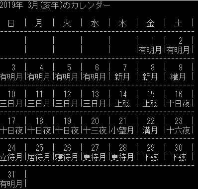

# 干支

カレンダー表示をリッチにする為、月齢と干支の表示を検討してみたいと思います。ざっと考えるに、干支の方が簡単そうなので、先ずはこちらから検討してみる事にします

ソフトウェアとしての実現方法を考える前に、まず**干支とは？**から考えてみます。というのも、筆者は**月齢と干支のいずれについても知識が心許(もと)ない**のです。では、十二支を並べておきましょう

| 漢字(読み)       | 動物(読み)   |
| ---------------- | ------------ |
| 子(し・ね)       | 鼠(ねずみ)   |
| 丑(ちゅう・うし) | 牛(うし)     |
| 寅(いん・とら)   | 虎(とら)     |
| 卯(ぼう・う)     | 兎(うさぎ)   |
| 辰(しん・たつ)   | 竜(りゅう)   |
| 巳(し・み)       | 蛇(へび)     |
| 午(ご・うま)     | 馬(うま)     |
| 未(び・ひつじ)   | 羊(ひつじ)   |
| 申(しん・さる)   | 猿(さる)     |
| 酉(ゆう・とり)   | 鶏(にわとり) |
| 戌(じゅつ・いぬ) | 犬(いぬ)     |
| 亥(がい・い)     | 猪(いのしし) |

## 分からない事

私見ですが

- 十二支と干支って何が違うの？
- 十二支の並びが覚えられない

という二点が大きな難関です。前者をWikipediaで見てみると

> 「**えと**」という呼称は本来、十干を「**ひのえ**」「**ひのと**」のように、**兄（え）**と**弟（と）**の組み合わせとして訓読したことに由来するが、今日では、**「干支」（えと）**と言えば十二支のことを指すことが多い

…何がなんだかサッパリ分からないので、**干支と十二支は同じ**と解釈する事にしました。


次に覚え方ですが、

「ねー、うしとら、うー、たつ、みー」

までは大丈夫なのですが、問題はここから先。この先はこう覚える事にしました

「うまひつじ」

「猿取犬井」

…私の頭のピースに上手くハマったので、しばらくは覚えていられそうです

## 干支の求め方

ネットで調べてみると

「西暦から1900を引いて…」

という**1900年以前の干支が求められない**やり方が多く紹介されていました。理屈はシンプルで、

「西暦1900年が子(ネズミ)年だから」

なのですが、これでは万年カレンダーで使い物になりません。(それならば、せめて**もっと昔の西暦4年(子(ネズミ)年)を基準にすれば長い範囲をカバー出来る**のに、と思いました)


これらの検討材料には以下のものがあります

1. 西暦1年は申(さる)年
2. 干支は12年で一回り

これらの情報から以下の計算式を導く事が出来ます

「西暦に8を足して、12で割った余りが干支の番号」

…が、**8を足す**というのが直観的ではありません。という訳で、西暦から干支を求める場合は、**申(さる)年スタートで一巡するテーブルを使う**と発想を切り替える事にしましょう

```cpp
const char*
calc_eto_fromAD( int year )
{
    // 西暦元年は申(しん・さる)年からスタートするので、
    // 申年スタート版の干支テーブルを作る
    const char* eto_table[] = {
        "申", //  0番目の干支 申(しん・さる)
        "酉", //  1番目の干支 酉(ゆう・とり)
        "戌", //  2番目の干支 戌(じゅつ・いぬ)
        "亥", //  3番目の干支 亥(がい・い)
        "子", //  4番目の干支 子(し・ね)
        "丑", //  5番目の干支 丑(ちゅう・うし)
        "寅", //  6番目の干支 寅(いん・とら)
        "卯", //  7番目の干支 卯(ぼう・う)
        "辰", //  8番目の干支 辰(しん・たつ)
        "巳", //  9番目の干支 巳(し・み)
        "午", // 10番目の干支 午(ご・うま)
        "未", // 11番目の干支 未(び・ひつじ)
    };    
    return eto_table[ year % 12 ];
} // calc_eto_fromAD()
```

# 月齢

次に月齢表示の追加について考えます。こちらはざっと考えただけでも検討課題が多そうですね。

- 月齢って、そもそも何？
- どうやって表示させるのか？
- そもそも月齢なんてどうやって知るのか？

という訳でネット検索で情報を集めてみました。

## 月齢とは？

**月の満ち欠けを周期化**したものとでもいいましょうか。**月の満ち欠けは太陽と月の関係から成るもの**とは中学生辺りで習うと思いますが、その頃月齢についてどう訊かされていたのかサッパリ思い出せません。

**月の満ち欠けの周期は、おおむね29日と半日(さしづめ29.5日といった所)**なので、大体一か月で一巡します。月齢は**新月を月齢1日、満月を14.7日**と言った風に記載するのですが、流石に日と月齢表記の併記はややこしくなりそうです。しかしご安心。雅を文化とする日本には**月名**があります

| 月齢  | 月名                   |
| ----- | ---------------------- |
| 1     | 新月（しんげつ）       |
| 2     | 繊月（せんげつ）       |
| 3     | 三日月（みかづき）     |
| 7/8   | 上弦（じょうげん）     |
| 10    | 十日夜                 |
| 13    | 十三夜（じゅうさんや） |
| 14    | 小望月（こもちづき）   |
| 15    | 満月（まんげつ）       |
| 16    | 十六夜（いざよい）     |
| 17    | 立待月（たちまちづき） |
| 18    | 居待月（いまちづき）   |
| 19    | 寝待月（ねまちづき）   |
| 20    | 更待月（ふけまちづき） |
| 22/23 | 下弦（かげん）         |
| 29/30 | 晦（つごもり）         |

歯抜けがあるのはご愛敬。そういう箇所は直前の月名を引っ張るようにします

## 月齢の算出式

年月日から概算出来る為の計算式が(その手の人には)広く知られているようなので、それを流用しましょう

```cpp
double
Calc_MoonAge( int year, int month, int day )
{
    double val = ( ( ( year - 2009 ) % 19 ) * 11 + month + day ) % 30;
    if( month <= 2 )
    {
        val += 2;
    }
    return val;
} // Calc_MoonAge()

const char*
Convert_MoonName( double moon_age )
{
    int age = ( int )moon_age;
    if( age <= 1 )       return " 新月 ";
    else if( age <=  2 ) return " 繊月 ";
    else if( age <=  6 ) return "三日月";
    else if( age <=  8 ) return " 上弦 ";
    else if( age <= 12 ) return "十日夜";
    else if( age <= 13 ) return "十三夜";
    else if( age <= 14 ) return "小望月";
    else if( age <= 15 ) return " 満月 ";
    else if( age <= 16 ) return "十六夜";
    else if( age <= 17 ) return "立待月";
    else if( age <= 18 ) return "居待月";
    else if( age <= 19 ) return "寝待月";
    else if( age <= 21 ) return "更待月";
    else if( age <= 23 ) return " 下弦 ";
    else if( age <= 26 ) return "有明月";
    else if( age <= 30 ) return "三十日";
    else　assert( 0 );
    return 0;
} // Convert_MoonName()

void
PrintMoonAge( ( int year, int month, int day )
{
    double moon_age = Calc_MoonAge( year, month, day );
    if( month <= 2 )
        moon_age += 2;
    return Convert_MoonName( moon_age );
} // PrintMoonAge()
```

## 月齢表示イメージ

これらの情報を元に、出力イメージを作成してみます



## システム検討

では、ソフトウェアの変更点を考えてみましょう。上のイメージ図より、従来の出力から以下のような変更が必要である事が分かります

- 罫線を入れる
- 日の下の行に月齢を入れる
- 月名を入れる為、文字間隔を調整する

罫線は単純に罫線記号を入れるだけなので大丈夫な気がします。しかし、月齢を日の合間に挟んでいく必要があり、こっちは少し考えなければいけません。変更点を含めたフローチャートを示しておきます。(実際には変数やフラグの操作が必要になりますが、抽象化を進める事でやりたい事を明確にしています)


上のフローチャートの★部分が変更点になります

### 月名出力の検討

月名の文字列を見てみると、最大長のもので全角文字３文字になっているので、以下のようにしました

- 罫線を入れて、文字列の区切りを明確にする
- ２文字のものは、両サイド半角スペースを1つずつ入れる

これに合わせて、１日までの出力位置スキップや日の出力幅についても変更します。また、１日までの出力位置スキップについては月齢出力時にも必要になるので関数化しておきます。同一の処理が２つ以上書く必要があるならば、関数化しておくと色々とスマートですね。


それぞれのソースコードの変更箇所を抜粋しておきます

#### １日までの出力位置スキップ

```cpp
static void
skip_start_position( eWeekday start_weekday )
{
    const char* skip_spaces = "      |";
    // 日部分の出力位置合わせ
    for( int skip = 0; skip < ( int )start_weekday; skip++ )
    {
        printf( skip_spaces );
    }
} // skip_start_position()
```

#### 日出力幅と干支表示の追加

```diff
void
PrintCalendar( int year, int month )
{
    printf(
-       "%4d年%2d月      のカレンダー\n"
+       "%4d年%2d月(%s年)のカレンダー\n"
        "\n"
-       "日 月 火 水 木 金 土\n"
+       "  日  |  月  |  火  |  水  |  木  |  金  |  土  |\n"
+       "-------------------------------------------------\n"
        ,
-        year, month );
+        year, month, calc_eto_fromAD( year ) );       
```

ここまででおおまかなレイアウト調整が完了した事になります。では、次は肝心の月齢出力に移りましょう

### 月齢出力

月齢を出力するタイミングは、フローチャートにある通り従来の土曜日出力後の改行直後。ここで処理する事で**一行毎に月齢出力処理を挟む**事が出来ます。では、月齢出力処理のフローチャートを示します。


フローチャートにあるprint_moon_age()の実装は以下の通りです

```cpp
static void
print_moon_age( int day_of_week, double moon_age )
{
    for( int idx = 0; idx < day_of_week; idx++ )
    {
        printf( "%s|", CMonthInfo::Convert_MoonName( moon_age ) );
        moon_age = ( int )( moon_age + 1 ) % 30;
    }
    printf( "\n-------------------------------------------------\n" );
} // print_moon_age()
```

### PrintCalendar変更内容

では、これまでの内容をPrintCalendar()に反映しましょう。変更箇所を抜粋します。

これで干支・月齢表示の対応が完了しました

```diff
    // 日部分を出力する
    int eom = GetEndOfMonth( year, month );
    DateInfo today = { year, month, 1, start_weekday };
+   // 月齢処理用変数
+   double cur_moon_age = Calc_MoonAge( year, month, 1 );
+   bool is_first_week = true; // 初週判定フラグ
+   int days_of_week = 0; // 現出力週の日数
    for( int day = 0; day < eom; day++ )
    {
        days_of_week++;
        printf( "  %2d  |", today.day );
        // 土曜日まで出力したら、改行して折り返す
        if( today.weekday == eSat )
        {
            printf( "\n" );
+           // 月齢出力
+           if( is_first_week ) // 初週分のスキップ処理
+               skip_start_position( start_weekday );
+           print_moon_age( days_of_week, cur_moon_age );
+           cur_moon_age = ( int )( cur_moon_age + days_of_week ) % 30;
+           days_of_week = 0;
+           is_first_week = false;
        }
        step_today_info( &today, eom ); // 1日進める
    }
    printf( "\n" );
+   print_moon_age( days_of_week, cur_moon_age );
} // PrintCalendar()
```

